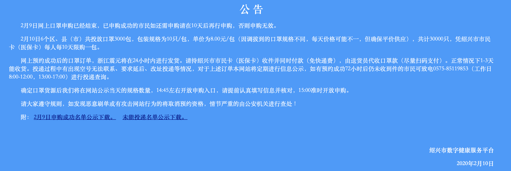

<!--
 * @Description: 
 * @Version: 
 * @School: Tsinghua Univ
 * @Date: 2020-02-10 13:37:25
 * @LastEditors  : Xie Yufeng
 * @LastEditTime : 2020-02-10 14:14:31
 -->
# mask
绍兴地区抢口罩半自动法

<div class="fig figcenter fighighlight">
  
  <div class="figcaption"><b>绍兴市数字健康服务平台:</b> http://health.sxws.gov.cn</div>
</div>

## acknowledge
https://github.com/liukelin/create_appleid

## environment
```
selenium
requests
Pillow
schedule
```

## principle
* open website complished by code, here I use chrome webdrive https://chromedriver.chromium.org/downloads 
* copy info in `config.py` user defined to website
* captcha user input manually
* schedule, run at time for `click` step

## file 
`mask.ipynb` code file

`/drive/` webdrive file, help open website complished by code, select right version (check your chrome application version) from https://chromedriver.chromium.org/downloads 

`/code` to save captcha
